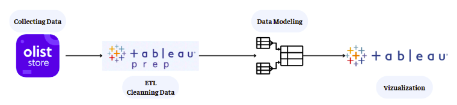
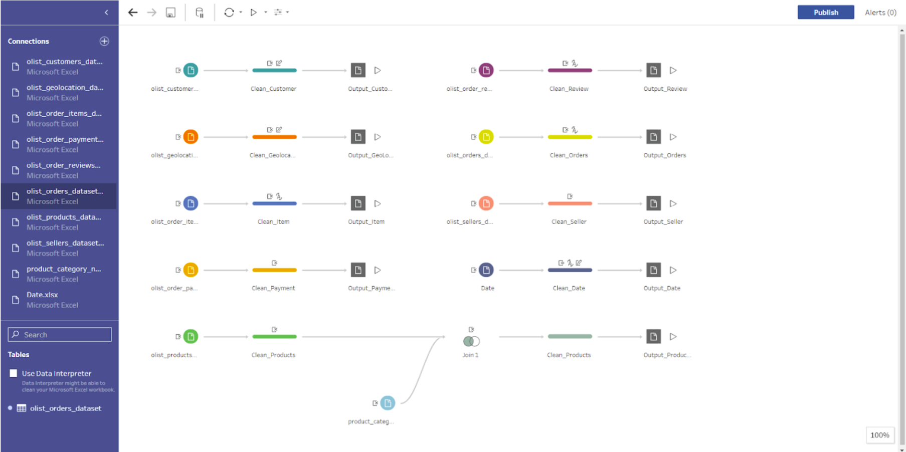
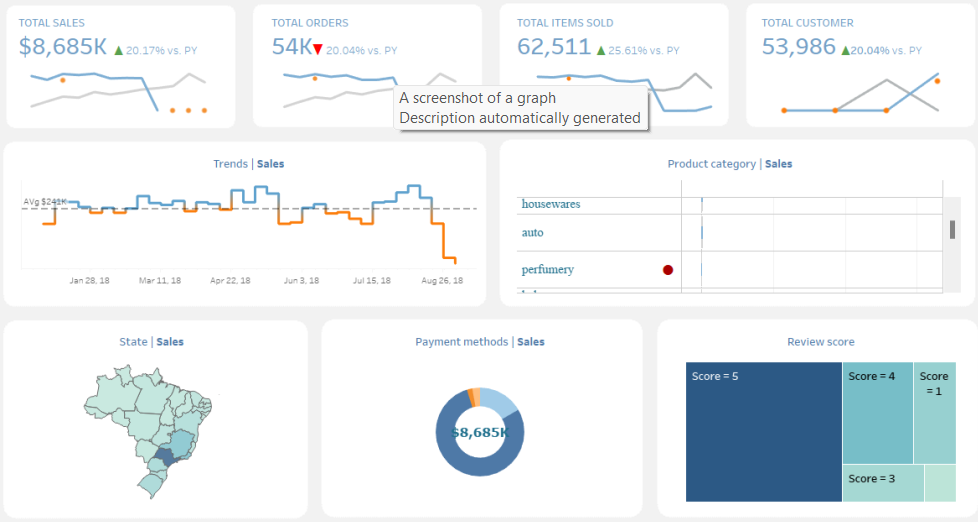
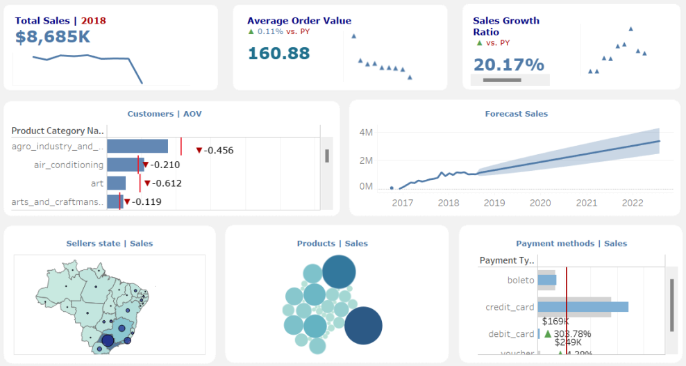
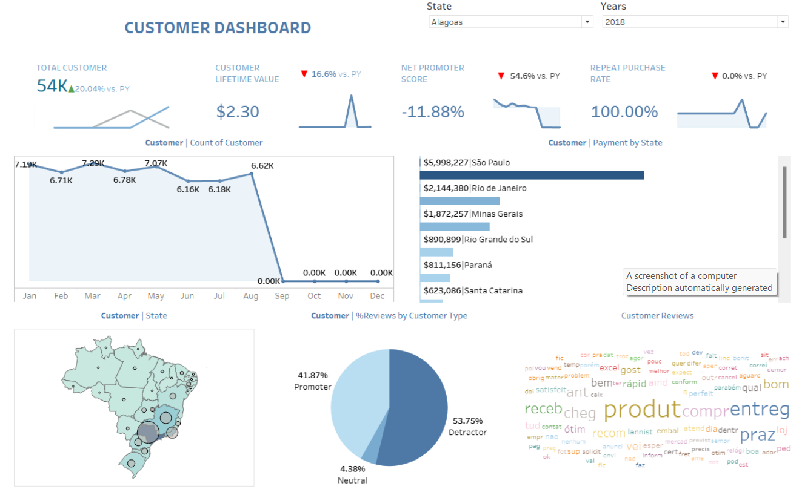
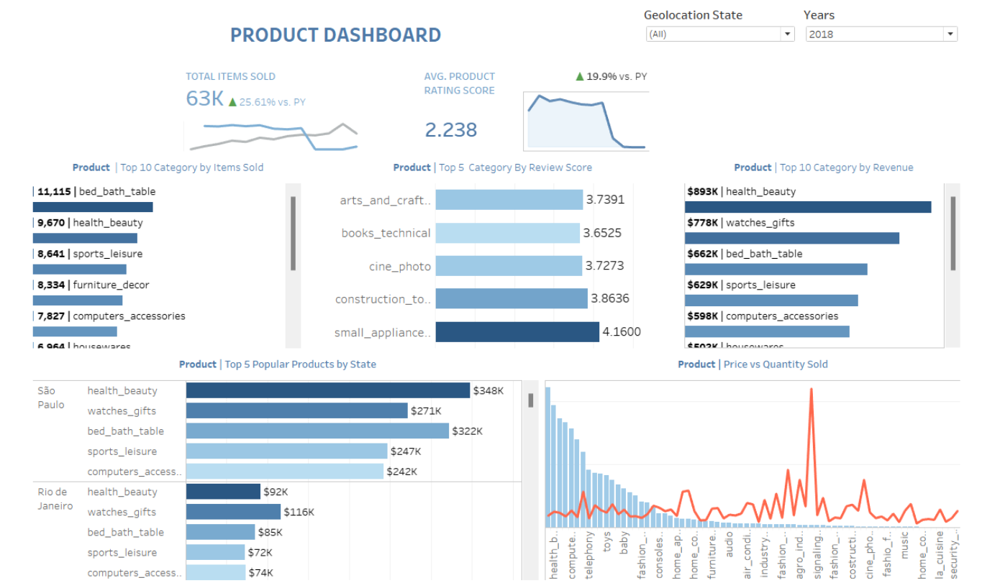
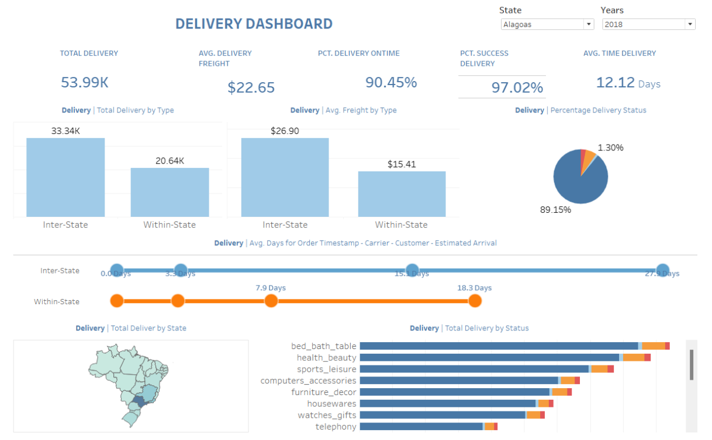

# APPLYING TABLEAU FOR THE ANALYSIS OF BUSINESS SITUATION 

## Introduction

This project, undertaken by Group 5.0 from the University of Economics and Law, focuses on developing a visualization to enhance the supply chain management of Olist E-Commerce platform in Brazil. Our aim is to visualize with Suply Chain KPIs to provide actionable insights and support informed decision-making.

## Team Members
- Lý Vũ Thiên Ân (K214161372)
- Hoàng Thị Nhật Quyên (K214162151)
- Trần Thị Ý Như (K214162149)
- Lê Tuấn Nguyên (K214160993)
- Lê Thị Bích Vân (K214162159)

## Proposed Model

Our proposed model efforts encompassed the following:

1. **Data Source Layer:**
- The Olist store serves as our initial data source for E-commerce sales related data from a Brazilian E-commerce website.

2. **Data Preparation Layer (ETL):**
- We employed Tableau Prep to Extract, Transform and Load, cleansing and structuring raw data obtained from Olist store.

3. **Data Modeling Layer:**
- Structured and organized the transformed datasets, combining into final datamarts adjusted to visualization purposes, ready for analysis.

4. **Data Consumption Layer (Visualization):**

Final transformed datasets are now integrated with Tableau to provide visualizations and enhance the process of discovering actionable insights and supporting the decision-making.

The "Olist_Dataset" is a relatively comprehensive dataset, divided into Excel files with specific content. However, to ensure a smooth visualization process and enable in-depth analysis based on the Dashboard presented in Tableau, the datasets extracted from the "Olist_Dataset" will be cleaned in Tableau Prep Builder and exported as Excel files.

## Dashboards Built

We developed an interactive Power BI dashboard to provide comprehensive insights into AWC's supply chain performance, integrating data from various sources to drive informed decision-making. The dashboard is organized into key areas:

### Overview

Shows overall revenue trends, order volumes, and customer numbers in both 2017 and 2018. While 2018 had a higher number of customers, the revenue showed a decreasing trend despite the total amount in numbers in 2017. Revenue is displayed both yearly as well as by month trend, as also overall, the general situation of numbers of clients versus sales

### Sales KPIs 2018

Tracks total revenue, average order value, and sales growth in 2018, with detailed breakdowns by product category, states, payment methods, and growth forecasts. Sales figures vary in many aspects, including growth rates, specific sales categories, and regions of Brazil.

### Sales KPIs 2017

Shows the different metrics for the sales section on the Olist Platform, including total sales and Average Order Value. These metrics, visualized with detailed figures by region and products categories. Payment methods are shown. The previous year growth of 12.276% is included as an extraordinary rate of growth, mostly attributed to a lower historical initial revenue, impacting overall comparisons.

### Customers KPIs

Shows total customers, lifetime value, satisfaction index, and repeat purchase rates in 2018. Displays trends and data broken down by payment methods, states and reviews. Even though new customers were numerous, overall customer satisfaction as a key performance parameter saw a decline compared to the previous year.

### Product KPIs

Display figures on the number of products sold and general customer satisfaction rating scores with different visual representations in 2018, including revenue generated by product categories. Most sold items, per region as well as the overall best products sold and most highly reviewed categories where used.

### Delivery KPIs

Includes the number of total order, average shipping costs, delivery time, on-time and successful rate performance. Includes data for both Internal and Interstate data showing different stages, time processing performance metrics in Olist data for 2018, in detail on the delivery by category by region.

## Conclusion

This research project successfully utilized data visualization (Tableau) to analyze Olist’s performance and extract actionable insights. This led to identification of key success factors, customer behaviours and allowed opportunities for improved operational efficiency, customer experience and growth in Brazil's e-commerce market.
